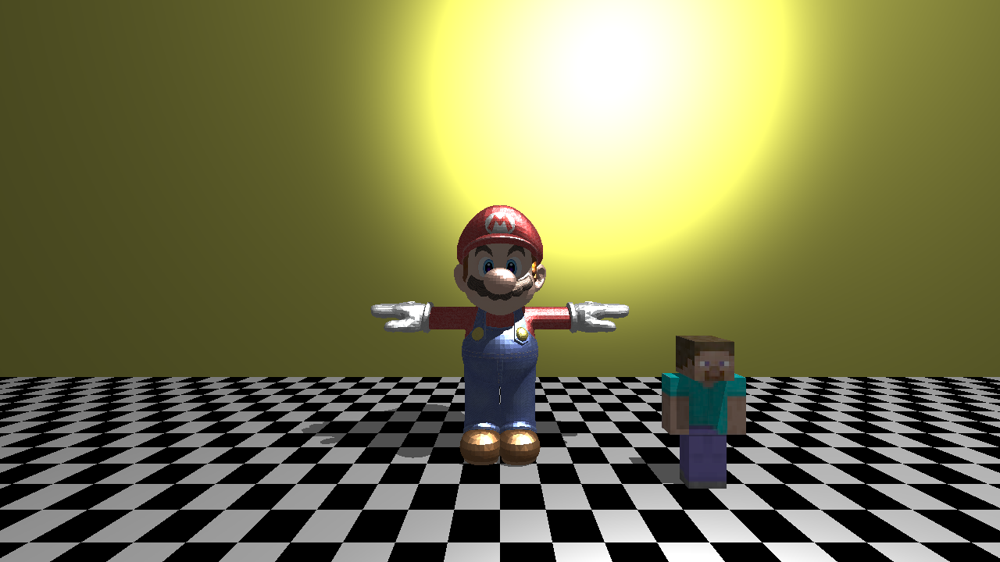
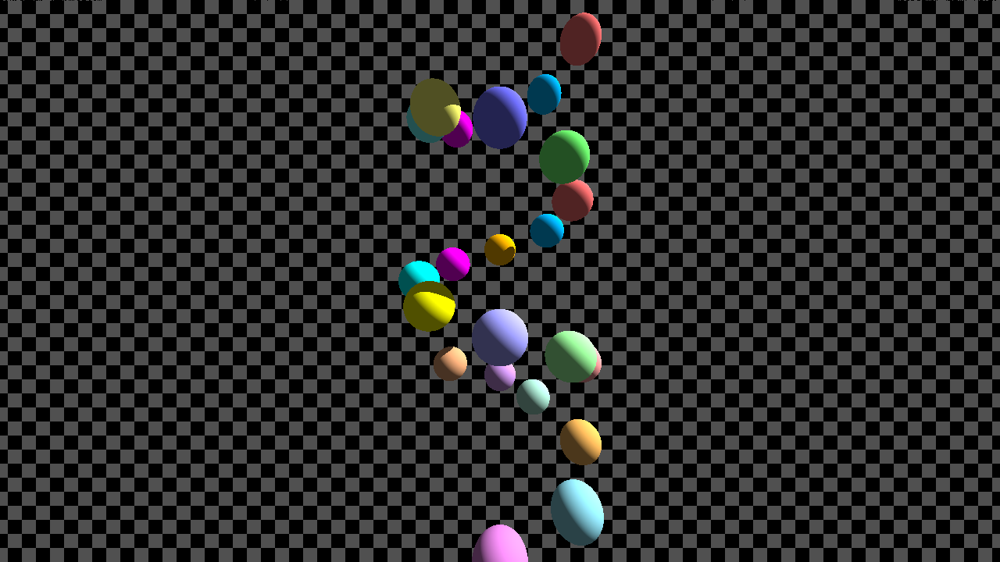
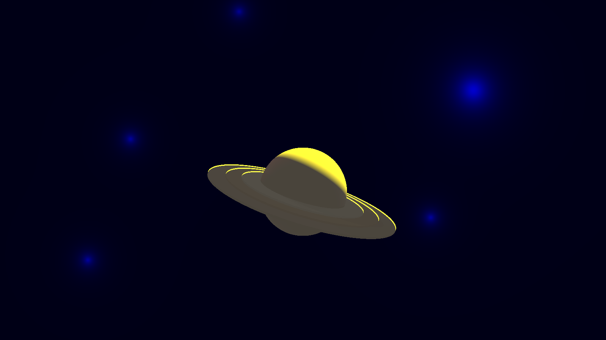
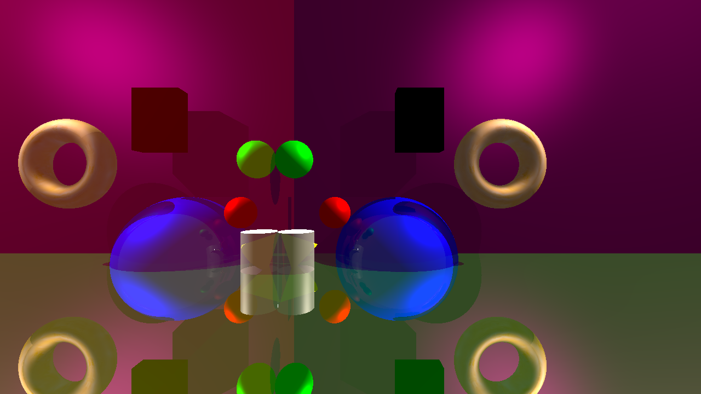
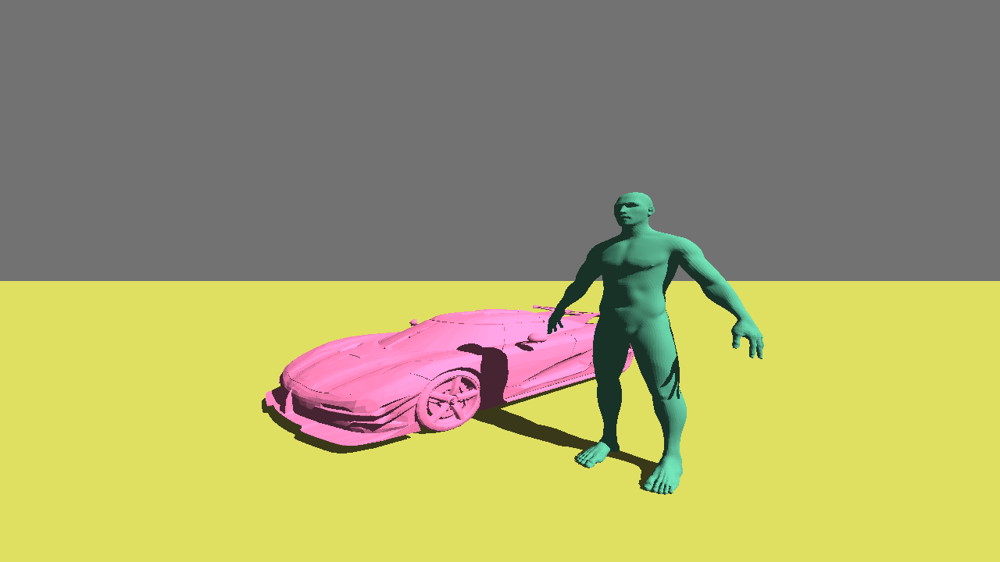

# RayTracer 💫

## 📝 Description

RayTracer est un moteur de rendu 3D hautes performances basé sur la technique du lancer de rayons. Cette technique simule le comportement de la lumière en traçant des rayons depuis la caméra à travers chaque pixel de l'écran virtuel jusque dans la scène 3D, permettant ainsi de créer des images réalistes avec des effets d'ombrage, de réflexion et de réfraction. Grâce à ses optimisations avancées, la génération des scènes est quasi instantanée, même pour des modèles complexes.

## 🌟 Fonctionnalités

- **Rendu de primitives 3D** : Sphères, Cylindres, Cônes, Plans
- **Système d'éclairage** : Sources de lumière directionnelles et ponctuelles
- **Caméra configurable** : Contrôle complet de la position, orientation et angle de vue de la caméra
- **Chargement dynamique** : Plugins pour ajouter facilement de nouvelles primitives et sources de lumière
- **Configuration flexible** : Descriptions de scènes personnalisables via des fichiers de configuration
- **Multi-threading CPU** : Accélération du rendu grâce au calcul parallèle sur tous les cœurs disponibles
- **Structure BVH** : Optimisation avancée par Bounding Volume Hierarchy pour un rendu quasi instantané
- **Import de modèles 3D** : Support des fichiers .obj pour intégrer des modèles 3D complexes
- **Générateur de configuration web** : Interface web pour créer et éditer facilement des fichiers de configuration

## 🖼️ Exemples de rendu

<p align="center">
  
  
</p>
<p align="center">
  
  
</p>

## 🛠️ Installation

```bash
# Cloner le dépôt
git clone https://github.com/EpitechPromo2028/B-OOP-400-MAR-4-1-raytracer-yanis.prevost.git
cd RayTracer

# Construire le projet
chmod +x build.sh
./build.sh
```

## 🚀 Utilisation

```bash
# Exécuter le ray tracer avec un fichier de configuration
./raytracer Config/basic.cfg

# Autres exemples de configuration
./raytracer Config/cow.cfg
./raytracer Config/Human.cfg
./raytracer Config/spirale.cfg
```

### 🎮 Contrôles de la caméra

Une fois le rendu lancé, vous pouvez vous déplacer dans la scène avec les contrôles suivants :
- **Z, Q, S, D** : Déplacement de la caméra (avant, gauche, arrière, droite)
- **Flèches directionnelles** : Modifier l'orientation de la caméra
- **Espace** : Monter
- **LShift** : Descendre
- **RShift** : Mode accéléré pour se déplacer plus rapidement

<p align="center">
  
</p>

## ⚡ Performances et Optimisations

### Génération de Scènes Quasi Instantanée

Notre RayTracer se distingue par sa capacité à générer des scènes complexes en quelques millisecondes, grâce à sa structure d'optimisation avancée :

#### Structure BVH (Bounding Volume Hierarchy)

Le moteur utilise une structure d'arbre binaire hiérarchique qui organise les objets de la scène dans des boîtes englobantes (AABB - Axis-Aligned Bounding Boxes). Cette approche permet :
- Une réduction drastique du nombre de tests d'intersection (de O(n) à O(log n))
- Un rendu quasi instantané même pour des scènes contenant des milliers d'objets
- Une scalabilité exceptionnelle lors de l'ajout de nouveaux objets
- Une organisation spatiale intelligente qui minimise les calculs inutiles

## 📋 Format des fichiers de configuration

Les fichiers de configuration (.cfg) permettent de décrire la scène à rendre, incluant:

```r
camera = {
    fieldOfView = 75.0;
    position = { x = 0.0; y = 4.0; z = 11.0; };
    rotation = { x = 0; y = 0; z = -1; };
    resolution = {
        width = 1280;
        height = 720;
    };
};

primitives = {
    spheres = (
        {
          x = 0.0; y = 0.0; z = 0.0; r = 1.0;
          color = { r = 255; g = 0; b = 0; };
        }
    );
    # Autres primitives...
};

lights = {
    point = (
        {
            position = { x = 0.0; y = 30.0; z = 40.0; };
            intensity = 0.7;
            color = { r = 255; g = 255; b = 255; };
        }
    );
};
```

## 🌐 Générateur de Configuration Web

Pour faciliter la création et l'édition des fichiers de configuration, nous avons développé une interface web intuitive accessible dans le dossier `docs/`:

Configurateur -> [Cliquez ici](https://yanisprevost.github.io/RayTracer/)

Cette interface permet de:
- Configurer visuellement tous les paramètres de la scène
- Prévisualiser la disposition des éléments
- Générer automatiquement le fichier de configuration (.cfg)

## 🧩 Architecture du projet

Le projet est organisé selon une architecture modulaire:

- **Core**: Moteur principal du ray tracer
- **Primitives**: Formes géométriques rendues (Sphère, Plan, etc.)
- **Lumières**: Sources d'éclairage (Directionnelle, Ponctuelle)
- **Parsing**: Analyse des fichiers de configuration
- **Visualisation**: Sortie des images au format PPM

## 🚀 Performances et Optimisations

### Multi-threading
Le RayTracer utilise le multi-threading pour accélérer considérablement les calculs de rendu:
- Parallélisation du calcul des pixels pour un rendu plus rapide
- Répartition optimale de la charge sur tous les cœurs du processeur
- Possibilité d'ajuster le nombre de threads pour s'adapter à différentes configurations matérielles

### Modèles 3D complexes
Le moteur prend en charge l'import de fichiers 3D au format .obj:
- Rendu de modèles 3D complexes créés dans des logiciels tiers comme Blender
- Support des normales et textures des objets
- Optimisation de la mémoire pour les modèles volumineux

<p align="center">
  
</p>

```bash
# Exemple d'utilisation avec un fichier 3D
./raytracer Config/Humain.cfg
```

### Architecture à plugins via bibliothèques partagées (.so)

Le RayTracer utilise un système de chargement dynamique de bibliothèques (DL) qui offre une grande flexibilité :
- **Primitives et lumières modulaires** : Chaque primitive et source de lumière est compilée en bibliothèque partagée (.so)
- **Extensibilité simplifiée** : Possibilité d'ajouter facilement de nouvelles primitives sans recompiler l'ensemble du projet

**Compilation automatique** :
- Le système CMake détecte automatiquement les nouveaux plugins et les compile en bibliothèques partagées
- Les .so générés sont placés respectivement dans ls dossier : `Plugins/Primitives/` et `Plugins/Lights/`

Cette architecture permet une séparation claire des responsabilités et facilite l'extension du moteur de rendu.

### Tests unitaires avec Criterion

Le projet intègre un système de tests unitaires utilisant la bibliothèque Criterion pour assurer la qualité et la robustesse du code :
- **Tests des composants fondamentaux** : Validation automatisée des classes de base (Vector3D, Point3D, Color)
- **Vérification mathématique** : Tests des opérations vectorielles, produits scalaires et vectoriels
- **Normalisation et transformations** : Validation des algorithmes de normalisation et transformations géométriques
- **Manipulation des couleurs** : Tests des opérations sur les couleurs (addition, multiplication, etc.)

**Exécution des tests** :
```bash
# Compiler avec les tests activés
./build.sh

# Lancer les tests unitaires
./unit_tests
```

## 🔧 Options avancées

Le RayTracer offre plusieurs options avancées:
- Réglage de la profondeur de réflexion et de réfraction
- Configuration des matériaux (brillance, transparence, réfraction)
- Possibilité d'ajouter de nouvelles primitives ou sources de lumière via le système de plugins
- Le déplacement en direct dans la scène pendant son chargement et après
- Rechargement automatique : Mise à jour en temps réel de la scène lorsque le fichier de configuration (.cfg) est modifié, sans avoir à redémarrer l'application

### Édition en temps réel

Le RayTracer surveille les modifications apportées au fichier de configuration chargé. Lorsque vous modifiez et enregistrez le fichier .cfg pendant l'exécution du programme, la scène est automatiquement rechargée avec les nouveaux paramètres. Cette fonctionnalité est particulièrement utile lors de la création et de l'ajustement de scènes complexes, permettant un workflow créatif beaucoup plus fluide et intuitif.

```bash
# Lancer le ray tracer et modifier le fichier en temps réel
./raytracer Config/basic.cfg
# Modifiez et enregistrez basic.cfg dans votre éditeur pour voir les changements instantanément
```

## 🖌️ Textures et Matériaux

Le RayTracer prend en charge l'application de textures sur les primitives 3D pour un rendu plus réaliste:

### Types de textures supportées
- **Textures d'image** : Fichiers JPG, JPEG et PNG

### Application de textures dans les fichiers de configuration

Pour appliquer une texture à une primitive, ajoutez une section `materials` dans sa configuration:

```r
primitives = {
    spheres = (
        {
            x = 0.0; y = 0.0; z = 0.0; r = 1.0;
            color = { r = 255; g = 255; b = 255; };
            material = "texutre1";
        }
    );
};

materials = {
    texture1 = {
        texture = "model/Textures/us.jpg";
        textureScale = 2.0; # Optionel
        shininess = 256.0; # Optionel
        reflexion = 0.9; # Optionel
        opacitiy = 0.4; # Optionel
    };
}
```

### Paramètres de texture

- **path** : Chemin vers le fichier de texture (relatif à la racine du projet)
- **textureScale** : Facteur d'échelle pour la texture (valeurs par défaut: 1.0)
- **shininess** : Coefficient de brillance du matériau (valeurs de 1 à 256, plus la valeur est élevée, plus la brillance est concentrée)
- **reflexion** : Facteur de réflexion de la lumière (valeur entre 0.0 et 1.0, 0 étant non réfléchissant, 1 étant un miroir parfait)
- **opacity** : Contrôle de la transparence du matériau (valeur entre 0.0 et 1.0)

### Exemple pratique avec textures

```bash
# Exécuter un exemple avec textures
./raytracer Config/Texture.cfg
```

La combinaison de textures et de matériaux permet d'obtenir des rendus très réalistes, comme notre exemple de planète Terre avec ses détails de surface.

## 👥 Contributeurs
- Yanis Prevost, Raphaël Grissonnanche, Anthony Colombani-Gailleur
